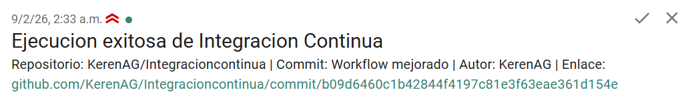

# Integración Continua con GitHub Actions

## Descripción del Proyecto

Este proyecto implementa un proceso básico de Integración Continua (Continuous Integration - CI) utilizando GitHub Actions. 

El objetivo principal es automatizar la ejecución de un programa sencillo en JavaScript y enviar una notificación automática cada vez que se realice un push a la rama principal del repositorio.

La automatización del proceso permite validar cambios de forma inmediata y generar alertas en tiempo real, aplicando principios fundamentales de DevOps.

## Objetivos

- Implementar un workflow de GitHub Actions.
- Automatizar la ejecución de un programa en Node.js.
- Enviar una notificación HTTP al servicio ntfy.sh tras cada push a la rama `main`.

## Tecnologías Utilizadas

- Node.js
- JavaScript
- Git
- GitHub
- GitHub Actions
- Curl
- ntfy.sh

## Funcionamiento del Pipeline

El workflow definido en `.github/workflows/alerta.yml` se ejecuta automáticamente bajo la siguiente condición:

- Evento: `push`
- Rama: `main`

### Flujo de ejecución:

1. Se detecta un push en la rama principal.
2. GitHub Actions inicia un entorno Ubuntu.
3. Se descarga el código del repositorio.
4. Se configura el entorno Node.js.
5. Se ejecuta el archivo `index.js`.
6. Se envía una notificación al canal `https://ntfy.sh/devops-itla`.

Este proceso demuestra una implementación básica de automatización dentro del ciclo de vida del desarrollo de software.

## Evidencia de Notificación

La siguiente imagen muestra un ejemplo de la notificación recibida tras la ejecución exitosa del workflow:

## Autora

Keren Guilamo  
Proyecto académico – DevOps  
Instituto Tecnológico de las Américas (ITLA)

